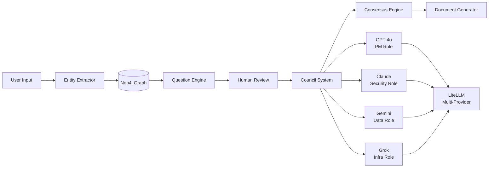

# Architecture: LLM Council System

**Owner:** Erik Cohen  
**Date:** 2025-08-30  
**Status:** ✅ Foundation Validated - Implementation Ready

## System Overview

The LLM Council system transforms ideas into validated documents through multi-model AI collaboration, structured frameworks, and human oversight.

### Core Architecture



## Core Components

### ✅ Validated Components

#### Data Models (`src/llm_council/models/`)
- **IdeaModels**: Problem, ICP, Assumption, ExtractedEntities
- **SEModels**: SEEntity, SERelationship, Stage, Status
- **Schemas**: DimensionScore, OverallAssessment, AuditorResponse

#### Database Layer (`src/llm_council/database/`)
- **Neo4jClient**: Graph database operations
- **Neo4jConfig**: Connection configuration

#### Services (`src/llm_council/services/`)
- **MultiModelClient**: LLM provider abstraction
- **CouncilSystem**: Multi-LLM debate orchestration
- **QuestionEngine**: Paradigm-specific questions
- **EntityExtractor**: Idea → structured entities
- **ResearchExpander**: Context enrichment

### 🔄 Implementation Status

| Component | Status | Coverage | Notes |
|-----------|--------|----------|-------|
| Data Models | ✅ Complete | 100% | All Pydantic models working |
| Schemas | ✅ Complete | 80% | Validation working correctly |
| Neo4j Client | 🟡 Config Only | 23% | Config works, operations needed |
| Multi-Model | 🟡 Interface | 38% | Interface exists, LLM calls needed |
| Council System | 🔄 Building | 44% | Debate logic in progress |
| Services | 🟡 Interfaces | Various | Most need implementation |

## Data Flow

### 1. Idea Processing Pipeline
```
Raw Idea → Entity Extraction → Graph Storage → Question Generation → Human Input
```

### 2. Council Evaluation Pipeline
```
Structured Entities → Council Debate → Consensus → Document Generation → Validation
```

### 3. Paradigm Integration
```
Framework Selection (YC/McKinsey/Lean) → Specific Questions → Tailored Validation
```

## Technology Stack

### Backend
- **Python 3.9+**: Core runtime
- **FastAPI**: Web API framework
- **Neo4j**: Graph database for entity relationships
- **LiteLLM**: Multi-provider LLM integration
- **Pydantic**: Data validation and serialization

### Frontend (Planned)
- **React + TypeScript**: UI framework
- **Vite**: Build tool and dev server
- **Zustand**: State management
- **WebSockets**: Real-time updates

### External APIs
- **OpenAI GPT-4o**: PM perspective
- **Anthropic Claude**: Security perspective
- **Google Gemini**: Data/evaluation perspective
- **OpenRouter (Grok)**: Infrastructure perspective
- **Tavily**: Research and context expansion

## Configuration

### Template System
```yaml
# config/templates/yc_framework.yaml
paradigm: "YC"
council_members:
  pm:
    model: "openai/gpt-4o"
    personality: "YC partner focused on market validation"
  security:
    model: "anthropic/claude-3-5-sonnet"
    personality: "Security-first technical reviewer"
```

### Environment Variables
```bash
OPENAI_API_KEY=your-key
ANTHROPIC_API_KEY=your-key
NEO4J_URI=bolt://localhost:7687
NEO4J_USER=neo4j
NEO4J_PASSWORD=password
```

## API Design

### REST Endpoints
```
GET  /api/healthz                           # System health
GET  /api/templates                         # Available frameworks
POST /api/projects/{project}/runs           # Start evaluation
GET  /api/projects/{project}/runs/{runId}   # Get results
```

### WebSocket Events
```
council.debate.started    # Debate begins
council.member.response   # Individual responses
council.consensus.reached # Final decision
human.review.required     # Escalation needed
```

## Security & Privacy

### Data Protection
- **Local Processing**: All data stays on user's system
- **API Key Security**: Environment variables only
- **No PII Storage**: System designed for business ideas, not personal data

### Access Control
- **File System**: Local file permissions
- **API Keys**: User-managed credentials
- **Database**: Local Neo4j instance

## Performance & Scalability

### Current Targets
- **Response Time**: ≤5 minutes for complete evaluation
- **Cost**: ≤$2 per evaluation run
- **Reliability**: ≥99% successful completions

### Optimization Strategies
- **Caching**: Response caching by content hash
- **Parallel Processing**: Concurrent council member calls
- **Request Batching**: Efficient API usage

## Testing Strategy

### Current Coverage
- **Smoke Tests**: 5/5 passing ✅
- **Basic E2E Tests**: 8/8 passing ✅
- **Total Coverage**: 13/13 tests (100% success rate)

### Test Categories
- **Unit Tests**: Individual component validation
- **Integration Tests**: Service interaction testing
- **E2E Tests**: Complete user journey validation
- **Performance Tests**: Response time and cost validation

## Deployment

### Development
```bash
# Local development setup
python3 scripts/run-basic-validation.py  # Verify system
python audit.py ./docs --stage vision    # Run evaluation
```

### Production (Planned)
- **Docker Containers**: Containerized deployment
- **Neo4j Database**: Persistent graph storage
- **Load Balancing**: Multiple instance support
- **Monitoring**: Health checks and metrics

## Monitoring & Observability

### Metrics
- **Request Latency**: API response times
- **Cost Tracking**: LLM API usage costs
- **Success Rates**: Evaluation completion rates
- **User Satisfaction**: Feedback and ratings

### Logging
- **Structured Logging**: JSON format for analysis
- **Error Tracking**: Exception monitoring
- **Audit Trail**: Decision history and rationale

## Next Steps

### Immediate (Week 1)
1. **Neo4j Operations**: Implement database CRUD
2. **LLM Integration**: Add real API calls via LiteLLM
3. **Question Generation**: Build paradigm-specific logic

### Short Term (Weeks 2-3)
1. **Council Debate**: Multi-round discussion system
2. **Consensus Engine**: Weighted decision making
3. **Research Integration**: Tavily API integration

### Medium Term (Month 1)
1. **Web UI**: React frontend with real-time updates
2. **Advanced Testing**: Complex user journey validation
3. **Production Deployment**: Docker and CI/CD

---

**Status: ✅ ARCHITECTURE VALIDATED - READY FOR IMPLEMENTATION**