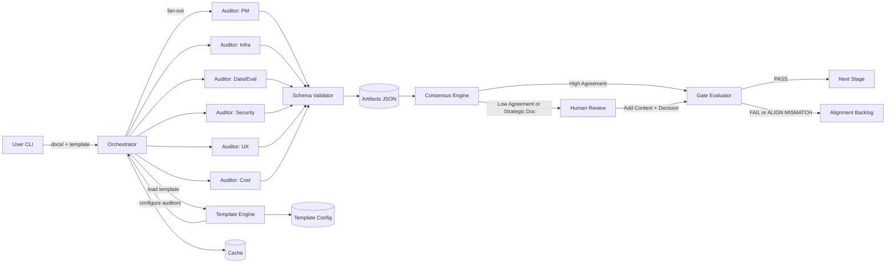

# ARCHITECTURE.md — LLM Council Audit & Consensus Platform

**Owner (Eng/Arch):** Erik Cohen 
**Date:** 2025-08-29  
**Status:** Draft  
**Links:** [Vision](./VISION.md) • [PRD](./PRD.md)

## 0) Context & Constraints
- Small CLI; local files; deterministic gates; low cost; parallel fan-out.
- **Framework Strategy:** Start with lightweight custom orchestration + OpenAI structured outputs for MVP. Migrate to CrewAI for v2 when agent coordination complexity increases.
- **Template-Driven:** Project types (Software MVP, AI/ML, Hardware, etc.) have pre-configured auditor questions and scoring weights.
- **Human-in-the-Loop:** Strategic documents (Vision, PRD) and consensus deadlocks require human review and context injection.

## 1) High-Level Overview

- Components: CLI Orchestrator, Template Engine, Auditor Workers, Schema Validator, Dedupe/Ranker, Consensus Engine, Human Review Interface, Gate Evaluator, Alignment Analyzer, Cache/Artifacts.

## 2) Data & Models

- Model(s): default OpenAI structured outputs (swap-able).  
- Templates: YAML configs per project type with auditor questions, weights, thresholds.
- Artifacts: per-auditor JSON, `audit.md`, `consensus_<DOC>.md`, `decision_<STAGE>.md`, `alignment_backlog_<DOC>.md`.  
- Hash key for cache: `(model, template_hash, prompt_hash, content_hash)`.

## 3) Interfaces & Contracts

- CLI: `audit.py <docs_dir> [--template] [--stage] [--model] [--max-calls] [--interactive]`.
- Template Config: YAML defining auditor questions, weights, stage-specific requirements, and human review triggers.
- Auditor schema: `scores_detailed{criterion→{score,pass,justification,improvements}}`, `blocking_issues[]`, `alignment_feedback{…}`.  
- Human Review Interface: Interactive prompts with consensus summary, disagreement highlights, and context injection.
- Exit codes: 0 success, 1 gate fail, 2 human review required.

## 4) Scaling & Performance
- Parallel auditor calls (configurable N).  
- Chunking when doc tokens > threshold.  
- Caching to minimize repeated calls.

## 5) Reliability & Operations
- Retries on JSON invalidity; graceful stop on `--max-calls`.  
- Idempotent runs; deterministic consensus thresholds from YAML.

## 6) Security & Privacy
- Secrets via env; redact logs; local filesystem only; no PII expected.  
- Audit log: write decision files with thresholds + counts.

## 7) Observability
- Token/time counters; counts in summary; artifacts persisted.

## 8) Cost & Viability
- Unit economics: #auditors × tokens; mitigations: cache, chunking, fewer roles.

## 9) Testing Strategy
- Unit: schema validators, consensus math.  
- Integration: full run on sample docs.  
- Golden tests: known inputs → fixed gate verdict.

## 10) Migration/Backfills
- None (MVP).

## 11) Decision Log (ADRs)

- ADR-001: Use CLI + files (not web) for MVP.  
- ADR-002: Trimmed weighted mean consensus (vs. majority/plurality).
- ADR-003: Start with custom orchestration + OpenAI structured outputs vs. LLM framework (CrewAI/LangGraph) for MVP to minimize complexity and maximize speed to market. Migrate to CrewAI for v2.
- ADR-004: Template-driven configuration over hardcoded questions to enable rapid new project type creation.
- ADR-005: Human-in-the-loop required for strategic documents (Vision/PRD) and consensus deadlocks. Automated decisions only for technical implementation docs.

### Gate checklist (Architecture → Implementation)
- [ ] Diagram + component boundaries defined.  
- [ ] Data flow, cache key, contracts documented.  
- [ ] Security/observability/cost strategies documented.  
- [ ] 0 **CRITICAL**, ≤4 **HIGH** open issues.
