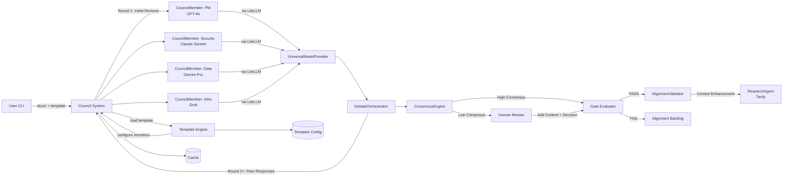

# ARCHITECTURE.md — LLM Council Audit & Consensus Platform

**Owner (Eng/Arch):** Erik Cohen
**Date:** 2025-08-29
**Status:** Draft
**Links:** [Vision](./VISION.md) • [PRD](./PRD.md)

## 0) Context & Constraints

- **Council-Based Architecture:** CouncilMember objects with distinct personalities, debate styles, and model assignments
- **Multi-Model Ensemble:** LiteLLM integration for OpenAI + Anthropic + Google + OpenRouter (Grok) provider flexibility
- **Iterative Debate System:** Multi-round discussion with consensus emergence detection and disagreement analysis
- **Research Integration:** Tavily API for internet context gathering in vision stage
- **Template-Driven:** Project types have pre-configured model assignments per role and debate configurations
- **Human-in-the-Loop:** Strategic documents and low consensus situations require human moderation

## 1) High-Level Overview

- **Components:** CLI Orchestrator, Council System, CouncilMember Objects, UniversalModelProvider (LiteLLM), DebateOrchestrator, ConsensusEngine, ResearchAgent (Tavily), AlignmentValidator, HumanReview Interface, Cache/Artifacts, Web UI (Vite + React + TypeScript).

### Frontend (Web UI)

- Vite + React + TypeScript for fast DX and end-to-end types
- Zustand for app state, Zod for runtime validation, React Query for data
- Shared types/schemas in `shared/types` and `shared/schemas` used by both FE/BE
- Dev: Vite dev server on `:3000` with proxy to FastAPI (`/api`, `/ws`)
- Prod: FastAPI serves `frontend/dist` at `/` and assets at `/assets`

Note: The legacy inline React page (`/static/ui.js`) has been removed. The FastAPI server now serves the Vite build or a short “build the frontend” message if the build is missing.

## 2) Data & Models

**Multi-Model Ensemble Strategy:**

- **Primary Models:** OpenAI GPT-4o, Anthropic Claude-3.5-Sonnet, Google Gemini-1.5-Pro
- **Specialized Providers:** OpenRouter (access to Grok, other models), Tavily (research context)
- **Model Assignment:** Different models per auditor role to maximize perspective diversity
- **Consensus Method:** Cross-model disagreement analysis with perspective synthesis

**Configuration:**

- Templates: YAML configs per project type with model assignments per role
- Artifacts: per-model-auditor JSON, `audit.md`, `consensus_<DOC>.md`, `decision_<STAGE>.md`, `alignment_backlog_<DOC>.md`
- Cache key: `(provider, model, template_hash, prompt_hash, content_hash)` - now includes provider

## 3) Interfaces & Contracts

- CLI: `audit.py <docs_dir> [--template] [--stage] [--ensemble] [--research-context] [--interactive]`
- Template Config: YAML defining auditor questions, model assignments per role, weights, and human review triggers
- Auditor Schema: `scores_detailed{criterion→{score,pass,justification,improvements}}`, `blocking_issues[]`, `model_perspective{unique_insights,model_bias_flags}`
- Multi-Model Response: Each auditor includes `model_provider` and `perspective_confidence` for diversity analysis
- Human Review Interface: Interactive prompts with cross-model disagreement analysis and perspective synthesis
- Exit codes: 0 success, 1 gate fail, 2 human review required, 3 model ensemble failure

## 4) Scaling & Performance

- Parallel auditor calls (configurable N).
- Chunking when doc tokens > threshold.
- Caching to minimize repeated calls.

## 5) Reliability & Operations

- Retries on JSON invalidity; graceful stop on `--max-calls`.
- Idempotent runs; deterministic consensus thresholds from YAML.

## 6) Security & Privacy

- Secrets via env; redact logs; local filesystem only; no PII expected.
- Audit log: write decision files with thresholds + counts.

## 7) Observability

- Token/time counters; counts in summary; artifacts persisted.

## 8) Cost & Viability

- Unit economics: #auditors × tokens; mitigations: cache, chunking, fewer roles.

## 9) Testing Strategy

- Unit: schema validators, consensus math.
- Integration: full run on sample docs.
- Golden tests: known inputs → fixed gate verdict.

## 10) Migration/Backfills

- None (MVP).

## 11) Decision Log (ADRs)

- ADR-001: Use CLI + files (not web) for MVP.
- ADR-002: Trimmed weighted mean consensus (vs. majority/plurality).
- ADR-003: Start with custom orchestration + OpenAI structured outputs vs. LLM framework (CrewAI/LangGraph) for MVP to minimize complexity and maximize speed to market. Migrate to CrewAI for v2.
- ADR-004: Template-driven configuration over hardcoded questions to enable rapid new project type creation.
- ADR-005: Human-in-the-loop required for strategic documents (Vision/PRD) and consensus deadlocks. Automated decisions only for technical implementation docs.
 - ADR-006: Remove unused legacy service layer and DI container for MVP. Keep implementation simple and focused on orchestrator + pipeline until service boundaries are needed by product requirements.

### Gate checklist (Architecture → Implementation)

- [ ] Diagram + component boundaries defined.
- [ ] Data flow, cache key, contracts documented.
- [ ] Security/observability/cost strategies documented.
- [ ] 0 **CRITICAL**, ≤4 **HIGH** open issues.
