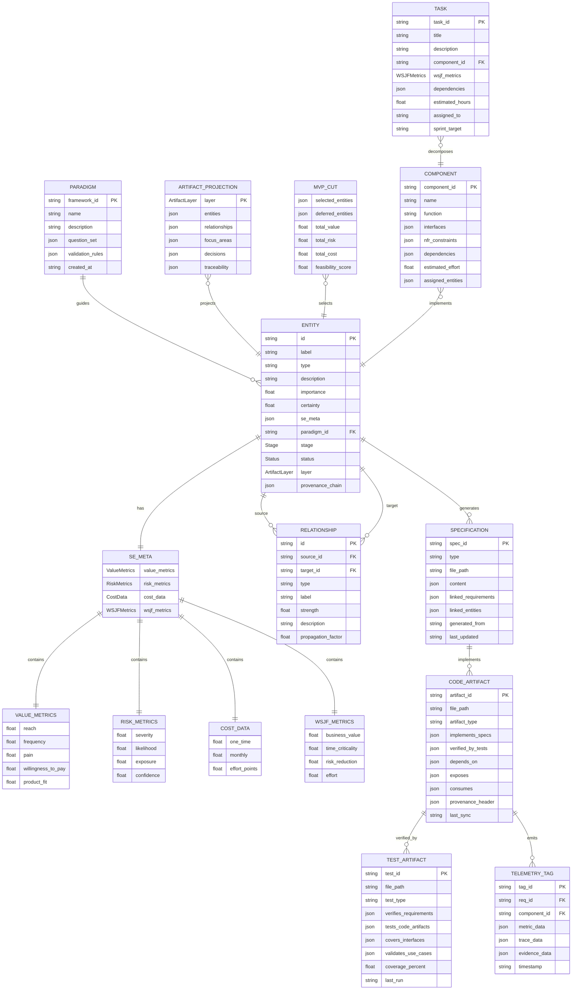
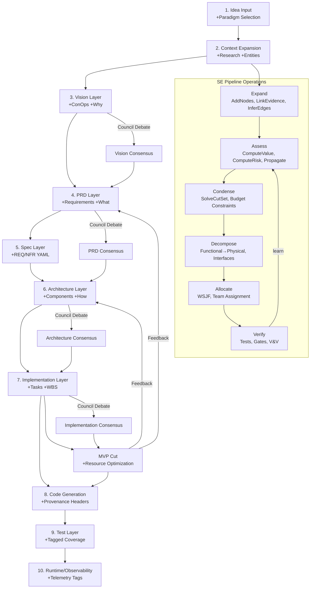
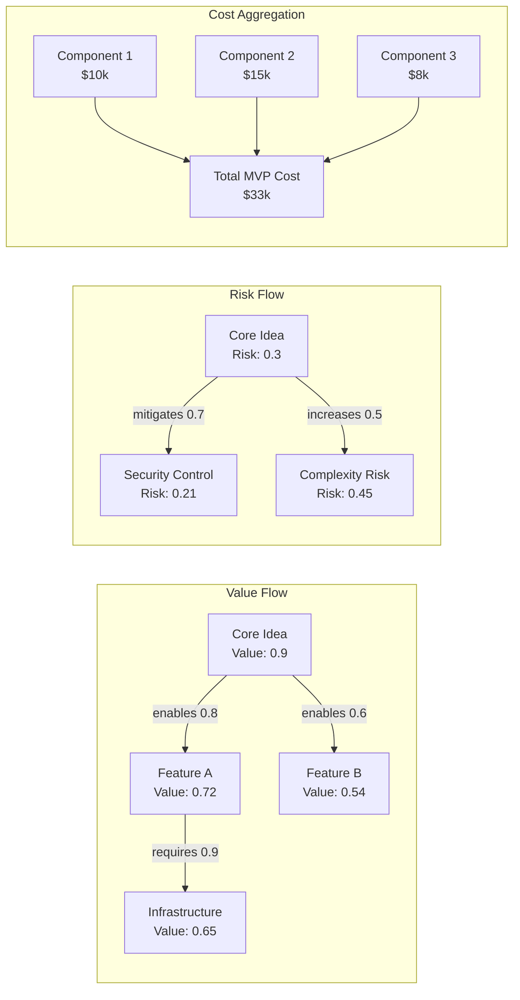
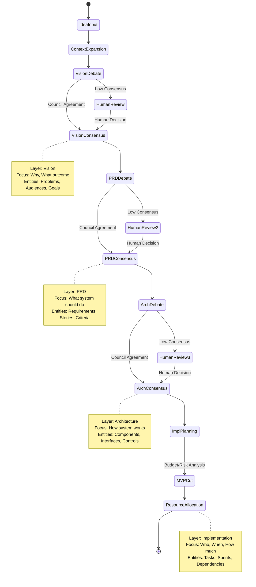

# Systems Engineering Pipeline Schema

## Graph-Native Artifact Flow



## Layered Artifact Pipeline



## Entity Type Hierarchy by Layer

```mermaid
graph TD
    subgraph "Vision Layer"
        VI_PROB[Problem Space]
        VI_AUD[Target Audience]
        VI_OUT[Desired Outcomes]
        VI_CONST[Constraints]
    end
    
    subgraph "PRD Layer"
        PRD_FR[Functional Requirements]
        PRD_NFR[Non-Functional Requirements]
        PRD_USER[User Stories]
        PRD_ACC[Acceptance Criteria]
    end
    
    subgraph "Architecture Layer"
        ARCH_COMP[Components]
        ARCH_INT[Interfaces]
        ARCH_DATA[Data Flows]
        ARCH_SEC[Security Controls]
    end
    
    subgraph "Spec Layer"
        SPEC_REQ[REQ-*.yaml Files]
        SPEC_NFR[NFR-*.yaml Files] 
        SPEC_API[OpenAPI/GraphQL Schemas]
        SPEC_DATA[JSON-Schema/Proto Files]
    end
    
    subgraph "Implementation Layer"
        IMPL_TASK[Development Tasks]
        IMPL_TEST[Test Cases]
        IMPL_DEP[Dependencies]
        IMPL_RISK[Implementation Risks]
    end
    
    subgraph "Code Artifact Layer"
        CODE_SVC[Services]
        CODE_MOD[Modules]
        CODE_CLS[Classes]
        CODE_FUN[Functions]
    end
    
    subgraph "Test Layer"
        TEST_UNIT[Unit Tests (REQ-tagged)]
        TEST_INT[Integration Tests (Interface-tagged)]
        TEST_E2E[E2E Tests (Use-case-tagged)]
        TEST_NFR[NFR Tests (Performance/Security)]
    end
    
    subgraph "Runtime Layer"
        RT_METRICS[Telemetry Metrics]
        RT_TRACES[Distributed Traces]
        RT_LOGS[Application Logs]
        RT_SLO[SLO Validation]
    end
    
    subgraph "MVP Scoped"
        MVP_FEAT[MVP Features]
        MVP_TASK[MVP Tasks]
        MVP_MILE[Milestones]
    end
    
    VI_PROB --> PRD_FR
    VI_AUD --> PRD_USER
    VI_OUT --> PRD_ACC
    PRD_FR --> SPEC_REQ
    PRD_NFR --> SPEC_NFR
    SPEC_REQ --> ARCH_COMP
    SPEC_NFR --> ARCH_SEC
    ARCH_COMP --> IMPL_TASK
    ARCH_INT --> IMPL_DEP
    IMPL_TASK --> CODE_SVC
    CODE_SVC --> CODE_MOD
    CODE_MOD --> CODE_CLS
    CODE_CLS --> CODE_FUN
    CODE_FUN --> TEST_UNIT
    SPEC_API --> TEST_INT
    PRD_USER --> TEST_E2E
    SPEC_NFR --> TEST_NFR
    TEST_UNIT --> RT_METRICS
    TEST_NFR --> RT_SLO
    IMPL_TASK --> MVP_TASK
    PRD_FR --> MVP_FEAT
```

## Value/Risk Propagation Model



## Decision Gates & Consensus Points

