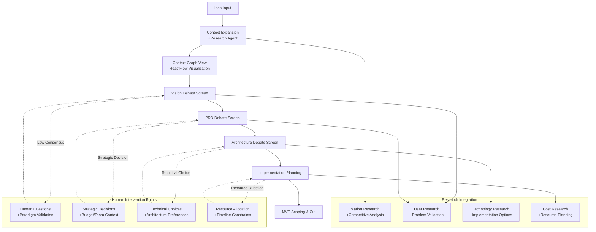
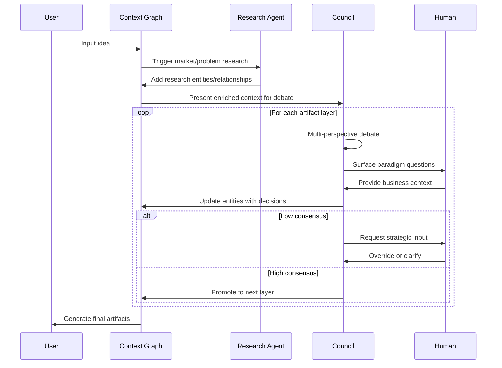

# Startup-Friendly UI Wireframe Schema

## Core UX Principles
1. **Familiar Layouts**: Linear sidebar + Slack threads + Notion structured fields
2. **Progressive Disclosure**: Bubbles → expand → full context
3. **Human-First Controls**: Override, clarify, split debates at every step
4. **Research Integration**: Automated context expansion with human validation

## Main Application Layout

```
┌─────────────────────────────────────────────────────────────────────────────┐
│ Header: LLM Council | Project: [Water Tracker] | Stage: [PRD → Architecture] │
├─────────────────────────────────────────────────────────────────────────────┤
│                                                                             │
│ ┌─Sidebar (Linear)──┐ ┌─Main Debate Thread (Slack)──┐ ┌─Details (Notion)─┐ │
│ │                   │ │                             │ │                  │ │
│ │ 🔍 Context Graph  │ │ Topic: User Authentication  │ │ FEAT-203        │ │
│ │  • Core Problem   │ │ ┌─────────────────────────┐ │ │ Stage: PRD      │ │
│ │  • Target Users   │ │ │ 📏 PM: "OAuth vs custom │ │ │ Consensus: 4.2/5│ │
│ │  • Key Features   │ │ │ auth increases scope"   │ │ │ Risk: Medium    │ │
│ │                   │ │ │ [Expand] [Ask Human]    │ │ │ Value: High     │ │
│ │ 🎯 Active Debates │ │ └─────────────────────────┘ │ │                  │ │
│ │  • Auth (4.2/5)   │ │ ┌─────────────────────────┐ │ │ 🧠 Human Qs:    │ │
│ │  • Storage (3.8/5)│ │ │ 🔒 Security: "OAuth    │ │ │ • Budget range? │ │
│ │  • MVP Cut (2.1/5)│ │ │ reduces attack surface" │ │ │ • Team exp?     │ │
│ │                   │ │ │ [Expand] [Research]     │ │ │ [Answer] [Skip] │ │
│ │ ✅ Resolved       │ │ └─────────────────────────┘ │ │                  │ │
│ │  • Login Flow     │ │ ┌─────────────────────────┐ │ │ 📊 Research:    │ │
│ │  • Basic CRUD     │ │ │ 👤 Human: "Team has    │ │ │ OAuth market    │ │
│ │                   │ │ │ OAuth exp, go with it" │ │ │ share: 78%      │ │
│ │ 📋 Backlog        │ │ │ [Override] [Clarify]    │ │ │ [Expand Context]│ │
│ │  • V1 Features    │ │ └─────────────────────────┘ │ │                  │ │
│ │  • V2 Ideas       │ │                             │ │ 🎯 Actions:     │ │
│ │  • Parked Items   │ │ ✅ Consensus: Use OAuth    │ │ │ [Approve]      │ │
│ │                   │ │ [Generate Tasks] [Override] │ │ │ [Request Info] │ │
│ └───────────────────┘ └─────────────────────────────┘ └──────────────────┘ │
│                                                                             │
└─────────────────────────────────────────────────────────────────────────────┘
```

## Screen Flow Hierarchy



## Debate Thread UI Pattern (Slack-style)

```
┌─ Topic: User Authentication Strategy ─────────────────────────────┐
│                                                                   │
│ ┌─ 📏 PM (GPT-4o) ─────────── [Expand] [Ask Human] ─┐ ⏱ 2:34pm │
│ │ OAuth vs custom auth increases scope for MVP.      │           │
│ │ Custom = 2-3 weeks, OAuth = 3-5 days.             │           │
│ │ Score: 3.8/5 (concerns: vendor dependency)        │           │
│ └───────────────────────────────────────────────────┘           │
│                                                                   │
│ ┌─ 🔒 Security (Claude) ───── [Expand] [Research] ──┐ ⏱ 2:35pm │
│ │ OAuth significantly reduces attack surface.        │           │
│ │ Custom auth = 15+ security controls to implement.  │           │
│ │ Score: 4.5/5 (strongly recommend OAuth)           │           │
│ └───────────────────────────────────────────────────┘           │
│                                                                   │
│ ┌─ 🧠 Human Input ────────── [Submit] [Skip] ───────┐ ⏱ 2:36pm │
│ │ Context: Team has OAuth experience (Auth0).        │           │
│ │ Budget constraint: <$500/mo for auth service.      │           │
│ │ Risk tolerance: Low (healthcare compliance)        │           │
│ └───────────────────────────────────────────────────┘           │
│                                                                   │
│ ┌─ 📊 Research Expansion ─── [Auto-generated] ──────┐ ⏱ 2:37pm │
│ │ Market data: 78% of SaaS apps use OAuth 2.0       │           │
│ │ Auth0 pricing: $23/mo for up to 1k users          │           │
│ │ HIPAA compliance: OAuth providers pre-certified    │           │
│ └───────────────────────────────────────────────────┘           │
│                                                                   │
│ ✅ Consensus: Use OAuth (Auth0) - Final Score: 4.4/5             │
│ [Generate Implementation Tasks] [Override Decision] [Split Topic] │
└───────────────────────────────────────────────────────────────────┘
```

## Human Question Paradigms by Layer

### Vision Layer Questions
```typescript
const visionParadigmQuestions = [
  {
    id: "vision_problem_clarity",
    text: "Is the core problem clearly defined? Rate clarity 1-5.",
    type: "human_required",
    weight: 2.0,
    rationale: "Humans have better intuition for problem-market fit"
  },
  {
    id: "vision_audience_specificity", 
    text: "Is the target audience specific enough? Describe ideal customer.",
    type: "human_preferred",
    weight: 1.8,
    rationale: "Humans understand customer nuances better than LLMs"
  },
  {
    id: "vision_budget_constraints",
    text: "What is the realistic budget range and timeline?",
    type: "human_only",
    weight: 2.5,
    rationale: "Only humans know actual resource constraints"
  }
]
```

### PRD Layer Questions
```typescript
const prdParadigmQuestions = [
  {
    id: "prd_user_workflow",
    text: "Walk through the complete user workflow step-by-step.",
    type: "human_preferred",
    weight: 2.0,
    rationale: "Humans catch workflow gaps that LLMs miss"
  },
  {
    id: "prd_success_metrics",
    text: "What specific metrics define success? Include targets.",
    type: "human_required",
    weight: 2.2,
    rationale: "Success metrics require business context"
  }
]
```

### Architecture Layer Questions
```typescript
const architectureParadigmQuestions = [
  {
    id: "arch_technology_constraints",
    text: "Any technology stack constraints or preferences?",
    type: "human_only",
    weight: 1.8,
    rationale: "Team expertise and infrastructure constraints"
  },
  {
    id: "arch_scalability_requirements",
    text: "Expected user scale and growth trajectory?",
    type: "hybrid",
    weight: 1.5,
    rationale: "LLM can estimate, human validates business projections"
  }
]
```

## Research Expansion Integration



## Implementation Priority: Startup Tool Patterns

### 1. Sidebar Navigation (Linear-style)
- **Context Graph**: Visual entity browser with filters
- **Active Debates**: In-progress council discussions
- **Resolved Decisions**: Archived consensus items  
- **Backlog**: Deferred features by stage (MVP/V1/V2)

### 2. Main Thread (Slack-style)
- **Council Member Bubbles**: Role-tagged, expandable responses
- **Human Input Prompts**: Paradigm questions with context
- **Research Insights**: Auto-expanded market/technical data
- **Consensus Status**: Real-time agreement tracking

### 3. Right Panel (Notion-style)
- **Structured Fields**: Value/Risk/Cost metrics
- **Evidence Links**: Research sources and traceability
- **Decision History**: Audit trail of choices made
- **Action Items**: Generated tasks and next steps

This creates a familiar workflow where:
1. **Context expansion** feels like research prep
2. **Council debates** feel like team discussions
3. **Human questions** feel like stakeholder input
4. **Consensus** feels like decision documentation
5. **Task generation** feels like sprint planning

## Detailed Screen Wireframes

### 1. Context Graph + Backlog View (Linear-style)

```
┌────────────────────────────────────────────────────────────────────────────────────┐
│ 🧠 LLM Council | Project: Water Tracker | Stage: Vision → PRD                       │
├────────────────────────────────────────────────────────────────────────────────────┤
│                                                                                    │
│ ┌─Context Graph──────────┐ ┌─Active Backlog (Linear-style)─────────────────────┐  │
│ │                        │ │                                                    │  │
│ │     [Core Problem]     │ │ 🎯 Vision Items (3 open, 2 resolved)              │  │
│ │          ↓             │ │ ┌─[OPEN]───────── Problem Definition ─── 4.2/5 ──┐│  │
│ │   [Target Users] ←─┐   │ │ │ Human Q: "Rate problem clarity 1-5"           ││  │
│ │          ↓         │   │ │ │ Research: Market size $2.3B, growing 15%     ││  │
│ │    [Key Features]  │   │ │ │ Council: 4/6 agree on scope                   ││  │
│ │          ↓         │   │ │ └───────────────────────────────────────────────┘│  │
│ │   [MVP Solution] ──┘   │ │                                                    │  │
│ │                        │ │ ✅ [RESOLVED] Target Audience                     │  │
│ │ [Expand Research]      │ │ ✅ [RESOLVED] Success Metrics                     │  │
│ │ [Generate Questions]   │ │                                                    │  │
│ └────────────────────────┘ │ 📋 PRD Items (queued)                             │  │
│                            │ • User Authentication Strategy                     │  │
│ ┌─Research Insights───────┐ │ • Data Storage Architecture                       │  │
│ │ 📊 Market Analysis      │ │ • API Design Approach                            │  │
│ │ • Size: $2.3B health   │ │                                                    │  │
│ │ • Growth: 15% CAGR     │ │ [Add Manual Item] [Batch Process] [Export Linear] │  │
│ │ • Competitors: 12 apps │ └────────────────────────────────────────────────────┘  │
│ │                        │                                                          │
│ │ 🔍 Problem Research    │                                                          │
│ │ • Hydration tracking   │                                                          │
│ │ • User pain points     │                                                          │
│ │ • Existing solutions   │                                                          │
│ └────────────────────────┘                                                          │
└────────────────────────────────────────────────────────────────────────────────────┘
```

### 2. Debate Thread View (Slack-style)

```
┌─ Topic: User Authentication Strategy (PRD Layer) ─────────────────────────────────┐
│                                                                    Status: Debating│
├───────────────────────────────────────────────────────────────────────────────────┤
│                                                                                   │
│ ┌─ 📏 PM (GPT-4o) ─────────────────────── [Expand] [Ask Human] ─┐ ⏱ 2:34pm     │
│ │ OAuth vs custom auth increases scope for MVP.                  │               │
│ │ • Custom auth: 2-3 weeks development                          │               │
│ │ • OAuth integration: 3-5 days                                 │               │
│ │ Score: 3.8/5 (concern: vendor dependency for critical flow)   │               │
│ └───────────────────────────────────────────────────────────────┘               │
│                                                                                   │
│ ┌─ 🔒 Security (Claude) ──────────────── [Expand] [Research] ───┐ ⏱ 2:35pm     │
│ │ OAuth significantly reduces attack surface and compliance risk. │               │
│ │ • Custom auth requires 15+ security controls                   │               │
│ │ • OAuth providers handle: encryption, audit logs, compliance   │               │
│ │ Score: 4.5/5 (strongly recommend OAuth for security)          │               │
│ └───────────────────────────────────────────────────────────────┘               │
│                                                                                   │
│ ┌─ 🧠 Human Context ──────────────────── [Submit] [Skip] ───────┐ ⏱ 2:36pm     │
│ │ 🤔 "What's your team's OAuth experience and budget for auth?"  │               │
│ │                                                               │               │
│ │ Team context: [___________________________]                   │               │
│ │ Budget range: [___________________________]                   │               │
│ │ Risk tolerance: [Low] [Medium] [High]                         │               │
│ │                                                               │               │
│ │ Additional context: [_________________________________]       │               │
│ └───────────────────────────────────────────────────────────────┘               │
│                                                                                   │
│ ┌─ 👤 Human Response ──────────────────── [Edit] [Confirm] ─────┐ ⏱ 2:38pm     │
│ │ Context: Team has Auth0 experience from previous project.      │               │
│ │ Budget: <$500/mo for auth service is acceptable.              │               │
│ │ Risk tolerance: Low (healthcare app, need compliance)          │               │
│ │ Decision: Go with Auth0, team is familiar and cost fits.      │               │
│ └───────────────────────────────────────────────────────────────┘               │
│                                                                                   │
│ ┌─ 📊 Research Auto-Expansion ─────────── [Auto-generated] ─────┐ ⏱ 2:39pm     │
│ │ OAuth market analysis:                                         │               │
│ │ • 78% of SaaS applications use OAuth 2.0                      │               │
│ │ • Auth0 pricing: $23/mo up to 1k MAU, $130/mo up to 10k      │               │
│ │ • HIPAA compliance: Auth0 BAA available, pre-certified        │               │
│ │ • Integration time: typically 1-3 days for standard setup     │               │
│ └───────────────────────────────────────────────────────────────┘               │
│                                                                                   │
│ ✅ Final Consensus: Use Auth0 OAuth - Score: 4.4/5 ── [Override] [Split] [Next] │
│                                                                                   │
│ Generated Implementation Tasks:                                                   │
│ • Set up Auth0 tenant configuration                                              │
│ • Implement OAuth callback handling                                              │
│ • Add user profile management                                                    │
│ [Export to Linear] [Create PRD Section] [Archive Thread]                        │
└───────────────────────────────────────────────────────────────────────────────────┘
```

### 3. Decision Panel (Notion-style)

```
┌─ FEAT-203: User Authentication ──────────────────────────────────────────┐
│                                                                           │
│ Layer: PRD                     Stage: MVP                               │
│ Consensus: 4.4/5              Status: Decided                          │
│ Last Updated: 2024-08-30                                                │
│                                                                           │
│ ┌─ Value/Risk/Cost Analysis ─────────────────────────────────────────┐   │
│ │ Value Score: 4.2/5                                                 │   │
│ │ • Reach: 0.9 (all users need auth)                                │   │
│ │ • Pain: 0.8 (security is critical)                                │   │
│ │ • Frequency: 1.0 (every session)                                  │   │
│ │                                                                     │   │
│ │ Risk Score: 2.1/5                                                  │   │
│ │ • Implementation: Low (Auth0 experience)                          │   │
│ │ • Vendor dependency: Medium (mitigated by standards)              │   │
│ │                                                                     │   │
│ │ Cost Estimate: $276/year                                          │   │
│ │ • Auth0 service: $23/mo × 12                                      │   │
│ │ • Development: 3 days × $50/hour                                  │   │
│ └─────────────────────────────────────────────────────────────────────┘   │
│                                                                           │
│ ┌─ Human Context & Decisions ────────────────────────────────────────┐   │
│ │ Budget Range: <$500/mo ✅                                          │   │
│ │ Team Experience: Auth0 (previous project) ✅                      │   │
│ │ Risk Tolerance: Low (healthcare compliance) ✅                    │   │
│ │                                                                     │   │
│ │ Key Decision: Use Auth0 OAuth with HIPAA BAA                      │   │
│ │ Rationale: Team expertise + compliance + cost fit                 │   │
│ └─────────────────────────────────────────────────────────────────────┘   │
│                                                                           │
│ ┌─ Traceability & Evidence ──────────────────────────────────────────┐   │
│ │ Links to Vision: User Security (VISION-12)                        │   │
│ │ Research Sources:                                                   │   │
│ │ • Auth0 pricing page (verified 2024-08-30)                        │   │
│ │ • HIPAA compliance guide (Auth0 docs)                             │   │
│ │ • OAuth 2.0 market analysis (Okta State of Auth)                  │   │
│ │                                                                     │   │
│ │ Council Votes:                                                      │   │
│ │ • PM: 3.8/5 (scope concern, but pragmatic)                        │   │
│ │ • Security: 4.5/5 (strong security benefits)                      │   │
│ │ • Infrastructure: 4.2/5 (proven solution)                         │   │
│ │ • Cost: 4.0/5 (within budget)                                     │   │
│ └─────────────────────────────────────────────────────────────────────┘   │
│                                                                           │
│ [Edit Decision] [Request Clarification] [Generate Tasks] [Archive]       │
└───────────────────────────────────────────────────────────────────────────┘
```

## Integration with Existing Council System

The paradigm questions and research expansion integrate seamlessly with our existing council debate system:

1. **Research Agent** auto-expands context before human questions
2. **Paradigm Questions** surface at strategic decision points  
3. **Council Members** debate with enhanced context from research + human input
4. **Human Review** handles strategic decisions and context validation
5. **Consensus Engine** incorporates human input weight into final scoring

This maintains the rigorous SE pipeline while feeling like familiar startup tools that product teams already use daily.

## Provenance & Traceability Visualization

### 4. Change Impact View (GitHub-style)

```
┌─ Change Impact Analysis: auth_service.py:45 ─────────────────────────────────┐
│                                                                               │
│ ┌─ 📝 Modified Function ──────────────────────────────────────────────────┐  │
│ │ Function: login_user()                                                   │  │
│ │ File: src/services/auth_service.py:45                                   │  │
│ │ Change: Added rate limiting logic                                        │  │
│ │ Author: @user                                            ⏱ 2:45pm       │  │
│ └──────────────────────────────────────────────────────────────────────────┘  │
│                                                                               │
│ ┌─ ⬆️ Upstream Impact Analysis ─────────────────────────────────────────┐  │
│ │ 📋 Requirements Affected:                                               │  │
│ │ • REQ-AUTH-001 (rate limiting now implemented) ✅                      │  │
│ │ • NFR-SEC-002 (security requirement enhanced) 🔄                       │  │
│ │                                                                         │  │
│ │ 📄 Documents Requiring Updates:                                         │  │
│ │ • PRD.md#authentication-requirements (add rate limit spec)             │  │
│ │ • ARCHITECTURE.md#security-controls (update auth flow diagram)         │  │
│ │ [Generate Doc Updates] [Review Changes] [Skip Updates]                 │  │
│ └─────────────────────────────────────────────────────────────────────────┘  │
│                                                                               │
│ ┌─ ⬇️ Downstream Impact Analysis ───────────────────────────────────────┐  │
│ │ 🧪 Tests Requiring Updates:                                             │  │
│ │ • test_auth_service.py (add rate limiting test cases) ❌               │  │
│ │ • test_auth_api.py (update integration tests) ❌                       │  │
│ │ • test_user_login.py (E2E test for rate limiting) ❌                   │  │
│ │                                                                         │  │
│ │ 📊 Specs Requiring Updates:                                             │  │
│ │ • api_auth.openapi.yaml (add 429 response codes) ❌                    │  │
│ │ • NFR-SEC-002.yaml (update security requirements) ❌                   │  │
│ │                                                                         │  │
│ │ 🔍 Runtime Impact:                                                      │  │
│ │ • Authentication latency: +15ms (acceptable for NFR-PERF-001)          │  │
│ │ • Rate limit telemetry: needs REQ-AUTH-001 tags                        │  │
│ │ [Generate Updates] [Run Tests] [Update Specs] [Deploy Metrics]         │  │
│ └─────────────────────────────────────────────────────────────────────────┘  │
│                                                                               │
│ 🔄 Symmetry Status: 5 artifacts need updates to maintain alignment          │
│ [Auto-Fix All] [Review Each] [Create PR] [Rollback Change]                  │
└───────────────────────────────────────────────────────────────────────────────┘
```

### 5. Traceability Matrix View (Spreadsheet-style)

```
┌─ Requirements Traceability Matrix ────────────────────────────────────────────┐
│ Filter: [All] [Missing Tests] [Orphaned Code] [Runtime Gaps]   🔄 Refresh    │
├───────────────────────────────────────────────────────────────────────────────┤
│ REQ_ID      │ FRS        │ Code                │ Tests           │ Coverage │ ✓ │
├─────────────┼────────────┼─────────────────────┼─────────────────┼──────────┼───┤
│ REQ-AUTH-001│ FRS-AUTH-001│ auth_service.py:45  │ test_auth*.py   │ 87%     │ ✅ │
│             │            │ auth_controller.py  │ test_auth_api.py│          │   │
├─────────────┼────────────┼─────────────────────┼─────────────────┼──────────┼───┤
│ REQ-USER-002│ FRS-USER-002│ user_service.py     │ test_user*.py   │ 92%     │ ✅ │
│             │            │ user_model.py       │                 │          │   │
├─────────────┼────────────┼─────────────────────┼─────────────────┼──────────┼───┤
│ REQ-DATA-003│ FRS-DATA-003│ data_service.py     │ ❌ MISSING      │ 0%      │ ❌ │
│             │            │ database.py         │                 │          │   │
├─────────────┼────────────┼─────────────────────┼─────────────────┼──────────┼───┤
│ ❌ ORPHAN   │ ❌ NONE    │ legacy_utils.py     │ ❌ NONE         │ N/A     │ ❌ │
├─────────────┼────────────┼─────────────────────┼─────────────────┼──────────┼───┤
│ 📊 Summary: │ 3 FRS      │ 6 code files       │ 4 test files    │ Avg: 60%│3/4│
└───────────────────────────────────────────────────────────────────────────────┘

Issues Found:
• REQ-DATA-003: Missing test coverage
• legacy_utils.py: Orphaned code with no requirement link
• Overall coverage below 80% target

[Generate Missing Tests] [Remove Orphaned Code] [Export Report] [Fix All Issues]
```

### 6. Runtime Telemetry Dashboard

```
┌─ Production Requirement Validation ───────────────────────────────────────────┐
│ Environment: Production | Last Updated: 2025-08-30 14:23:15 UTC              │
├───────────────────────────────────────────────────────────────────────────────┤
│                                                                               │
│ ┌─ REQ-AUTH-001: User Authentication ─────────────────────────── ✅ PASS ─┐  │
│ │ SLO: 99.9% uptime, <500ms p95 latency                                   │  │
│ │ Current: 99.97% uptime, 245ms p95 latency                               │  │
│ │ Evidence: 847,291 successful auth events in last 24h                    │  │
│ │ [View Traces] [Alert History] [Requirement Details]                     │  │
│ └──────────────────────────────────────────────────────────────────────────┘  │
│                                                                               │
│ ┌─ NFR-PERF-001: API Performance ─────────────────────────── ⚠️ WARNING ─┐  │
│ │ SLO: <200ms p95 for API endpoints                                       │  │
│ │ Current: 234ms p95 (trending up, investigation needed)                  │  │
│ │ Evidence: API /users endpoint degrading since deployment                │  │
│ │ [Investigate] [Scale Resources] [Requirement Review]                    │  │
│ └──────────────────────────────────────────────────────────────────────────┘  │
│                                                                               │
│ ┌─ REQ-DATA-003: Data Storage ────────────────────────────── ❌ FAIL ────┐  │
│ │ SLO: Zero data loss, <1s query response                                 │  │
│ │ Current: 3 data inconsistencies detected, 1.2s avg response             │  │
│ │ Evidence: Data integrity checks failing                                  │  │
│ │ [Emergency Response] [Review Implementation] [Update Requirements]      │  │
│ └──────────────────────────────────────────────────────────────────────────┘  │
│                                                                               │
│ 📊 Overall Status: 2/3 requirements passing in production                    │
│ [Generate Report] [Review All SLOs] [Update Dashboards]                      │
└───────────────────────────────────────────────────────────────────────────────┘
```

This UI design ensures complete visibility into the provenance chain and enables rapid identification of symmetry breaks between requirements and implementation.